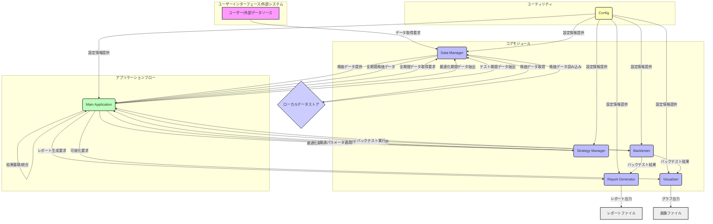

# 株取引ボット 要件定義書兼設計書

## 1. 要件定義

### 1.1. 目的
本プロジェクトは、株取引戦略のバックテストとパフォーマンス分析を自動化するボットを開発することを目的とします。これにより、ユーザーは様々な取引戦略の有効性を検証し、投資判断の精度を向上させることができます。

### 1.2. 機能要件

- **データ管理機能**:
    - 指定されたティッカーシンボル、期間に基づいて株価データを取得し、ローカルに保存できること。
    - 保存された株価データを読み込み、バックテストに利用できること。
- **戦略管理機能**:
    - 移動平均線、RSI、MACDなどの一般的なテクニカル指標に基づいた取引戦略を定義できること。
    - 複数の戦略を管理し、切り替えて利用できること。
- **バックテスト機能**:
    - 定義された取引戦略に基づき、過去の株価データを用いて仮想取引を実行できること。
    - バックテストの結果として、総損益、最大ドローダウン、勝率、取引回数などの主要なパフォーマンス指標を算出できること。
    - **複数戦略比較機能**: 複数の戦略を同時にバックテストし、そのパフォーマンスを比較できること。
    - **ウォークフォワード最適化機能**: 過去データを最適化期間とテスト期間に分割し、最適化期間で最適な戦略パラメータを探索し、テスト期間でそのパラメータの有効性を検証できること。
    - **複数銘柄対応**: 複数のティッカーシンボルの株価データを同時に取得・処理し、統合されたポートフォリオとしてバックテストできること。
- **レポート生成機能**:
    - バックテスト結果を基に、詳細なパフォーマンスレポートを生成できること（例: HTML, PDF形式）。
    - レポートには、取引履歴、損益グラフ、各種統計情報が含まれること。
    - **複数戦略比較レポート**: 複数の戦略のパフォーマンス指標を比較したレポートを生成できること。
- **可視化機能**:
    - バックテストのパフォーマンス（例: 累積損益、ポートフォリオ価値の推移）をグラフで表示できること。
    - 取引シグナルと株価の動きを重ねて表示できること。
    - **複数戦略比較グラフ**: 複数の戦略の累積損益やポートフォリオ価値の推移を同一グラフ上に表示し、比較できること。
- **設定管理機能**:
-     データ取得元、保存パス、戦略パラメータなどの設定を外部ファイルで管理できること。

### 1.4. 用語集

- **ティッカーシンボル**: 株式市場で特定の企業や証券を識別するために使われる略称（例: AAPL, 9984.T）。
- **移動平均線 (Moving Average, MA)**: 一定期間の株価の平均値を線で結んだもの。トレンドの方向性や転換点を示す指標。
- **RSI (Relative Strength Index)**: 相対力指数。買われすぎか売られすぎかを判断するオシレーター系のテクニカル指標。
- **MACD (Moving Average Convergence Divergence)**: 移動平均収束拡散。トレンドの方向性や勢いを判断するテクニカル指標。
- **バックテスト**: 過去の市場データを用いて、特定の取引戦略がどれだけ有効であったかをシミュレートすること。
- **総損益**: バックテスト期間中の全ての取引における最終的な損益。
- **最大ドローダウン (Maximum Drawdown)**: 資産のピークから谷までの最大の落ち込み幅。リスク指標の一つ。
- **勝率**: 総取引回数のうち、利益が出た取引の割合。
- **取引回数**: バックテスト期間中に行われた売買の総回数。
- **取引シグナル**: 特定の取引戦略に基づいて生成される、買い（Buy）または売り（Sell）の指示。

### 1.3. 非機能要件

- **パフォーマンス**: 大量の株価データに対しても、バックテストが許容可能な時間内に完了すること。
- **保守性**: モジュール化された設計により、機能追加や変更が容易であること。
- **拡張性**: 新しい取引戦略やデータソースを容易に追加できること。
- **信頼性**: データ取得、バックテスト、レポート生成の各プロセスが安定して動作すること。
- **可読性**: コードはPEP8に準拠し、適切なドキュメンテーションが施されていること。

## 2. 概要設計

### 2.1. 全体像

本システムは、以下の主要なモジュールで構成されます。



- `src/main.py`: アプリケーションのエントリーポイント。ウォークフォワード最適化の全体フローを制御し、データ管理、戦略管理、バックテスト、レポート生成、可視化の各モジュールを連携させます。複数銘柄のデータを扱い、統合された結果を生成します。
- `src/config.py`: アプリケーション全体の設定（APIキー、データパス、戦略パラメータなど）を管理します。
- `src/data_manager.py`: 株価データの取得、保存、読み込みを担当します。
- `src/strategy_manager.py`: 取引戦略の定義、適用、管理を行います。
- `src/backtester.py`: 定義された戦略に基づき、過去データでバックテストを実行し、取引結果をシミュレートします。
- `src/report_generator.py`: バックテスト結果から詳細なパフォーマンスレポートを生成します。
- `src/visualizer.py`: バックテスト結果やポートフォリオの推移をグラフで可視化します。

### 2.4. データ構造の詳細

本システムで主に扱うデータはPandas DataFrame形式であり、以下の主要な構造を持ちます。

#### 2.4.1. 株価データ (`pd.DataFrame`)

`DataManager`によって取得・読み込まれる株価データは、以下のカラムを持つDataFrameとして扱われます。

| カラム名    | 型         | 説明                                       |
| :---------- | :--------- | :----------------------------------------- |
| `Date`      | `datetime` | 日付                                       |
| `Open`      | `float`    | 始値                                       |
| `High`      | `float`    | 高値                                       |
| `Low`       | `float`    | 安値                                       |
| `Close`     | `float`    | 終値                                       |
| `Volume`    | `int`      | 出来高                                     |
| `Adj Close` | `float`    | 調整後終値（配当や株式分割を考慮した終値） |

#### 2.4.2. 取引シグナルデータ (`pd.DataFrame`)

`StrategyManager`によって生成される取引シグナルは、株価データに以下のカラムが追加されたDataFrameとして扱われます。

| カラム名      | 型      | 説明                                            |
| :------------ | :------ | :---------------------------------------------- |
| `Signal`      | `int`   | 取引シグナル (`1`: 買い, `-1`: 売り, `0`: なし) |
| `MA_Short`    | `float` | 短期移動平均線（例: 5日移動平均線）             |
| `MA_Long`     | `float` | 長期移動平均線（例: 20日移動平均線）            |
| `RSI`         | `float` | RSI値                                           |
| `MACD`        | `float` | MACD線                                          |
| `Signal_Line` | `float` | シグナル線（MACDの移動平均線）                  |
| `Histogram`   | `float` | ヒストグラム（MACDとシグナル線の差）            |

※ `MA_Short`, `MA_Long`, `RSI`, `MACD`, `Signal_Line`, `Histogram` は、適用される戦略によって追加されるテクニカル指標のカラム例です。

#### 2.4.3. バックテスト結果 (`dict` および `pd.DataFrame`)

`Backtester`によって生成されるバックテスト結果は、主に以下の要素を含む辞書形式で返されます。

-   **`metrics` (`dict`)**: パフォーマンス指標の辞書。
    -   `total_profit`: 総損益
    -   `max_drawdown`: 最大ドローダウン
    -   `win_rate`: 勝率
    -   `total_trades`: 総取引回数
    -   `final_capital`: 最終資本
    -   `annualized_return`: 年率リターン
    -   `sharpe_ratio`: シャープ・レシオ
    -   `sortino_ratio`: ソルティノ・レシオ
    -   `calmar_ratio`: カルマー・レシオ
    -   `volatility`: ボラティリティ
    -   `cagr`: 年平均成長率
    -   `alpha`: アルファ
    -   `beta`: ベータ
-   **`trades` (`pd.DataFrame`)**: 個々の取引履歴のDataFrame。
    | カラム名         | 型         | 説明                             |
    | :--------------- | :--------- | :------------------------------- |
    | `Date`           | `datetime` | 取引日                           |
    | `Type`           | `str`      | 取引タイプ (`Buy` または `Sell`) |
    | `Price`          | `float`    | 取引価格                         |
    | `Shares`         | `int`      | 取引株数                         |
    | `P/L`            | `float`    | 損益                             |
    | `Cumulative P/L` | `float`    | 累積損益                         |
    | `Capital`        | `float`    | 取引後の資本                     |
-   **`portfolio_value` (`pd.Series`)**: 日ごとのポートフォリオ価値の推移。
-   **`all_walk_forward_results` (`list[dict]`)**: 各ウォークフォワードテスト期間のサマリー結果を格納するリスト。
-   **`all_walk_forward_trades` (`pd.DataFrame`)**: 全ウォークフォワードテスト期間の取引履歴を統合したDataFrame。
-   **`final_integrated_portfolio_df` (`pd.DataFrame`)**: 全ウォークフォワードテスト期間のポートフォリオ価値推移を統合したDataFrame。

## 3. 開発環境と実行方法

### 3.1. 必要なもの

-   Python 3.9+
-   `pip` (Pythonのパッケージインストーラ)

### 3.2. 環境構築手順

1.  **リポジトリのクローン**:
    ```bash
    git clone https://github.com/your-repo/stock_trading_bot.git
    cd stock_trading_bot
    ```
2.  **仮想環境の作成とアクティベート**:
    プロジェクトの依存関係を分離するために仮想環境の使用を推奨します。
    ```bash
    python -m venv venv
    # Windowsの場合
    .\venv\Scripts\activate
    # macOS/Linuxの場合
    source venv/bin/activate
    ```
3.  **依存ライブラリのインストール**:
    `requirements.txt` に記載されている全てのライブラリをインストールします。
    ```bash
    pip install -r requirements.txt
    ```
    （注: `requirements.txt` が存在しない場合は、`pip install pandas yfinance matplotlib seaborn fpdf2` など、必要なライブラリを個別にインストールしてください。）

### 3.3. アプリケーションの実行

`src/main.py` を実行することで、バックテストとレポート生成のワークフローが開始されます。

```bash
python src/main.py
```

実行後、設定に基づいた株価データの取得、戦略の適用、バックテストの実行、レポートとグラフの生成が行われます。

## 4. エラーハンドリングとロギング

### 4.1. エラーハンドリング

-   **データ取得エラー**: ネットワークの問題やAPI制限などにより株価データが取得できない場合、適切なエラーメッセージを出力し、処理を中断またはスキップします。
-   **ファイルI/Oエラー**: データの読み書き時にファイルが見つからない、アクセス権がないなどのエラーが発生した場合、例外を捕捉し、ユーザーに分かりやすいメッセージを提示します。
-   **不正な入力**: 設定ファイルやコマンドライン引数に不正な値が指定された場合、バリデーションを行い、エラーメッセージと共に正しい使用方法を案内します。

### 4.2. ロギング

-   Pythonの標準 `logging` モジュールを使用し、アプリケーションの実行状況をログに出力します。
-   ログレベル（DEBUG, INFO, WARNING, ERROR, CRITICAL）を適切に使い分け、問題発生時のデバッグを容易にします。
-   ログはコンソールに出力するだけでなく、ファイルにも保存できるように設定します。

## 5. テスト戦略

### 5.1. テストフレームワーク

-   Pythonの標準的なテストフレームワークである `pytest` を使用します。

### 5.2. テストコードの配置

-   テストコードは `tests/` ディレクトリ以下に、`src/` ディレクトリと同じモジュール構造で配置します。
    例: `src/data_manager.py` のテストは `tests/test_data_manager.py` に配置します。

### 5.3. テストの種類

-   **単体テスト**: 各クラスのメソッドや関数の独立した機能を検証します。モックオブジェクトを使用して外部依存を排除し、テストの独立性と再現性を高めます。
-   **結合テスト**: 複数のモジュールが連携して正しく機能するかを検証します。例えば、`DataManager` で取得したデータを `StrategyManager` が処理し、`Backtester` がバックテストを実行する一連の流れをテストします。

### 5.4. テストの実行方法

-   プロジェクトのルートディレクトリで以下のコマンドを実行することで、全てのテストが実行されます。
    ```bash
    pytest
    ```
-   特定のテストファイルのみを実行する場合は、ファイルパスを指定します。
    ```bash
    pytest tests/test_data_manager.py
    ```
-   テスト実行後、カバレッジレポートを生成することも可能です。
    ```bash
    pytest --cov=src --cov-report=html
    ```

### 2.2. 機能一覧

| 機能カテゴリ     | 機能名                     | 概要                                                                           | 担当モジュール                          |
| :--------------- | :------------------------- | :----------------------------------------------------------------------------- | :-------------------------------------- |
| **データ管理**   | 株価データ取得             | Yahoo Financeなどから指定期間の株価データを取得し、CSVで保存                   | `DataManager`                           |
|                  | 株価データ読み込み         | 保存されたCSVファイルを読み込み、Pandas DataFrameとして提供                    | `DataManager`                           |
| **戦略管理**     | 戦略定義                   | 移動平均線、RSI、MACDなどのテクニカル指標に基づく戦略を定義                    | `StrategyManager`                       |
|                  | 戦略適用                   | 定義された戦略を株価データに適用し、取引シグナルを生成                         | `StrategyManager`                       |
| **バックテスト** | バックテスト実行           | 指定された戦略とデータに基づき、仮想取引を実行し、結果を記録                   | `Backtester`                            |
|                  | パフォーマンス算出         | バックテスト結果から総損益、ドローダウンなどの指標を算出                       | `Backtester`                            |
|                  | **ウォークフォワード実行** | 最適化期間とテスト期間にデータを分割し、戦略パラメータの最適化と検証を繰り返す | `Main`, `Backtester`, `StrategyManager` |
|                  | **複数銘柄バックテスト**   | 複数の銘柄に対して同時にバックテストを実行し、統合されたポートフォリオを管理   | `Main`, `Backtester`                    |
|                  | **複数戦略比較実行**       | 複数の戦略を同時にバックテストし、結果を比較                                   | `Main`, `Backtester`                    |
| **レポート生成** | レポート生成               | バックテスト結果とパフォーマンス指標を基に、レポートを生成                     | `ReportGenerator`                       |
|                  | **複数戦略比較レポート**   | 複数の戦略のパフォーマンス指標を比較したレポートを生成                         | `ReportGenerator`                       |
| **可視化**       | パフォーマンス可視化       | 累積損益、ポートフォリオ価値の推移などをグラフで表示                           | `Visualizer`                            |
|                  | シグナル可視化             | 株価チャート上に取引シグナル（買い/売り）を表示                                | `Visualizer`                            |
|                  | **複数戦略比較グラフ**     | 複数の戦略の累積損益やポートフォリオ価値の推移を同一グラフ上に表示             | `Visualizer`                            |
| **設定管理**     | 設定読み込み               | 設定ファイル（例: `config.ini`）から各種設定を読み込む                         | `Config`                                |

### 2.3. クラス構成（主要クラス）

#### `src/data_manager.py`
- **`DataManager` クラス**:
    - `get_stock_data(ticker: str, start_date: str, end_date: str) -> pd.DataFrame`: 指定されたティッカーと期間の株価データを取得します。
    - `save_data(df: pd.DataFrame, filename: str)`: DataFrameをCSVファイルとして保存します。
    - `load_data(filename: str) -> pd.DataFrame`: CSVファイルを読み込み、DataFrameとして返します。

#### `src/strategy_manager.py`
- **`StrategyManager` クラス**:
    - `define_strategy(strategy_name: str, params: dict) -> Callable`: 戦略名とパラメータに基づいて取引戦略関数を定義します。
    - `apply_strategy(data: pd.DataFrame, strategy: Callable) -> pd.DataFrame`: 株価データに戦略を適用し、取引シグナル（買い/売り）を生成します。

#### `src/backtester.py`
- **`Backtester` クラス**:
    - `run_backtest(data: pd.DataFrame, strategy: Callable, initial_capital: float = 100000.0) -> dict`: 株価データと戦略を用いてバックテストを実行し、取引履歴とパフォーマンス指標を返します。
    - `calculate_metrics(results: dict) -> dict`: バックテスト結果から詳細なパフォーマンス指標を算出します。

#### `src/report_generator.py`
- **`ReportGenerator` クラス**:
    - `generate_report(metrics: dict, trades: pd.DataFrame, output_path: str, output_format: str = 'html')`: パフォーマンス指標と取引履歴からレポートを生成し、指定された形式で保存します。

#### `src/visualizer.py`
- **`Visualizer` クラス**:
    - `plot_performance(results: dict, output_path: str)`: バックテストの累積損益やポートフォリオ価値の推移をグラフで表示し、画像ファイルとして保存します。
    - `plot_signals(data: pd.DataFrame, output_path: str)`: 株価チャート上に取引シグナルを表示し、画像ファイルとして保存します。

#### `src/main.py`
- **`main()` 関数**:
    - アプリケーションのエントリーポイント。
    - `DataManager` を使用して全期間の株価データを取得し、テクニカル指標を計算します。
    - ウォークフォワードループを制御し、最適化期間とテスト期間にデータを分割します。
    - `StrategyManager` を使用して最適化期間で戦略パラメータを最適化します。
    - 最適化されたパラメータを用いて、テスト期間で `Backtester` を実行します。
    - 各ウォークフォワード期間のバックテスト結果（取引履歴、ポートフォリオ価値推移、サマリー）を蓄積します。
    - 全期間のポートフォリオ価値推移を統合し、`Visualizer` でグラフを生成します。
    - 統合された結果とサマリーを用いて `ReportGenerator` でレポートを生成します。

#### `src/config.py`
- **設定項目**:
    - `START_DATE`, `END_DATE`: データ取得の開始日と終了日。
    - `TICKER_SYMBOLS`: バックテスト対象のティッカーシンボルリスト。
    - `INITIAL_CASH`: 各バックテスト期間の初期資金。
    - `LEVERAGE_RATIO`: レバレッジ比率。
    - `OPTIMIZATION_WINDOW_DAYS`: ウォークフォワード最適化期間の日数。
    - `TEST_WINDOW_DAYS`: ウォークフォワードテスト期間の日数。
    - `WALK_FORWARD_STEP_DAYS`: ウォークフォワードのステップ日数。
    - `STRATEGIES`: 各戦略のパラメータ